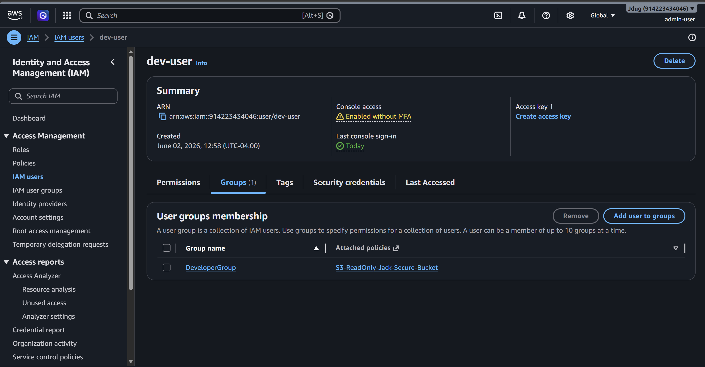
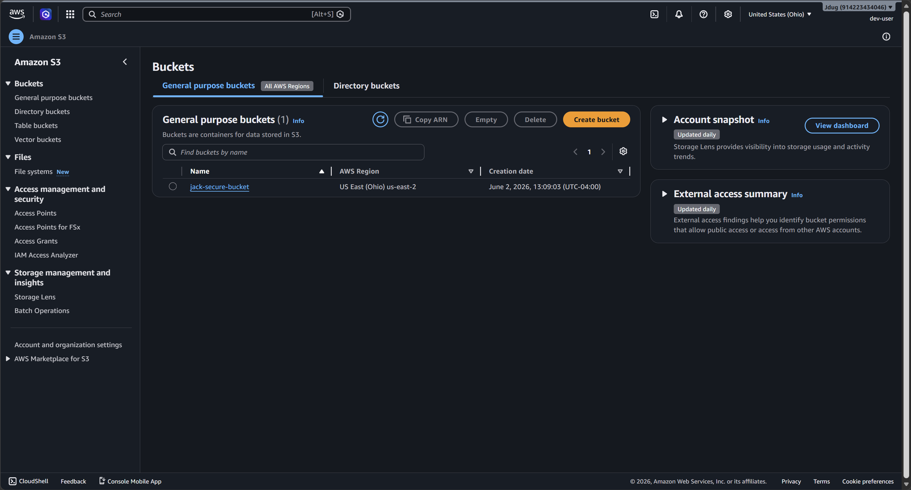
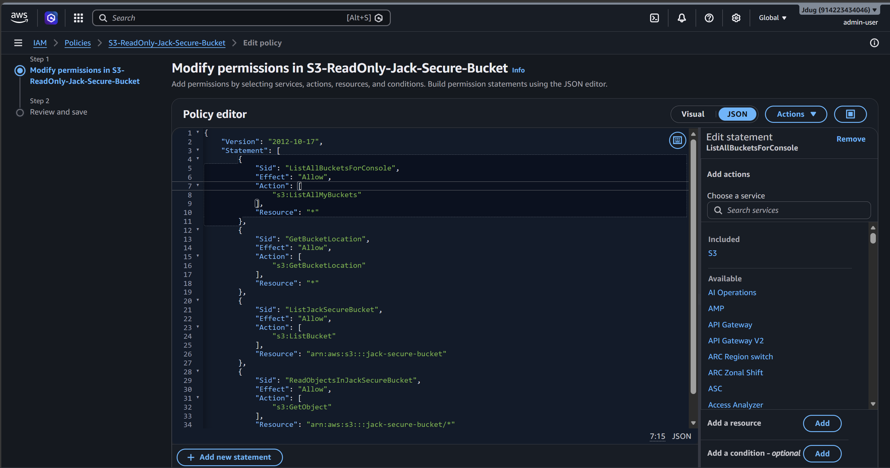
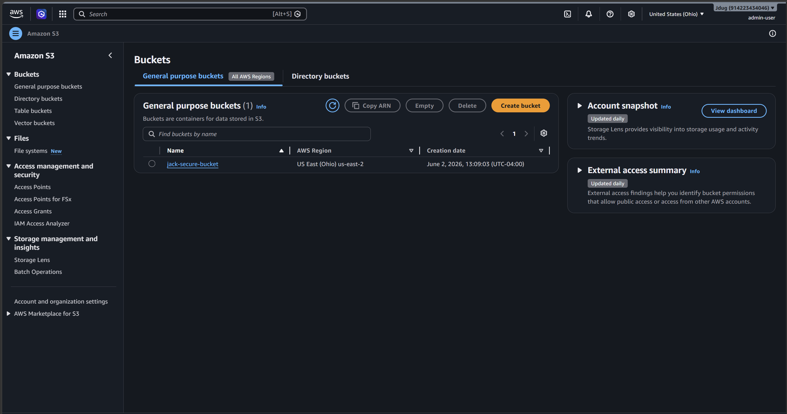
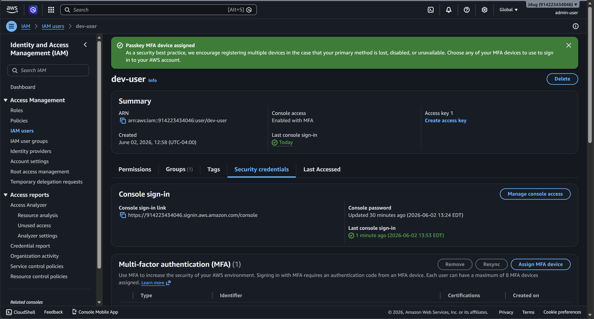

# AWS-IAM-S3-Least-Privilege-Access-Project-
AWS Least Privilege IAM Project
This project demonstrates how I implemented a least‑privilege access model in AWS using IAM users, groups, and custom JSON policies. The goal was to restrict identities to only the permissions required for their tasks and verify the configuration through access testing.

Overview
I created a small IAM environment in AWS to show how least‑privilege access works in practice. The project includes:
IAM user and group creation
Custom policy design
Permissions boundary usage
Testing allowed and denied actions
Screenshots documenting each step
All screenshots are stored in the screenshots folder.

1. IAM User Setup  
Created an IAM user (dev-user) with console access.  

2. Group Assignment  
Added the user to DeveloperGroup, which contains the custom S3 read-only policy.  

3. Custom S3 Read-Only Policy  
Created a policy that allows the user to list buckets and read objects only from jack-secure-bucket.  

4. S3 Bucket Setup  
Created a secure S3 bucket named jack-secure-bucket for testing.  

5. MFA Enforcement  
Enabled MFA on the IAM user to follow AWS security best practices.  

Results
The least‑privilege model worked as expected. Users were able to perform only the actions defined in their policies, and attempts to access unauthorized services or operations were denied.

Key Takeaways
Least‑privilege access reduces risk and limits the impact of compromised credentials
Permissions boundaries add an extra layer of control
Testing is essential to confirm policy behavior
IAM requires clear structure and documentation
